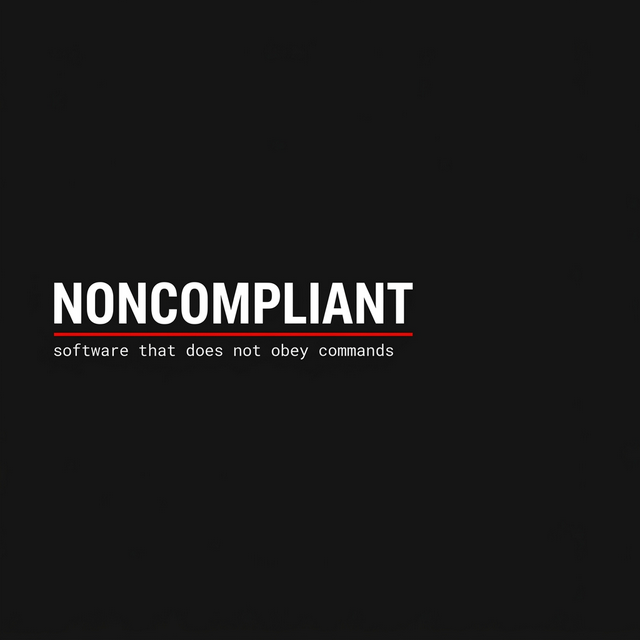
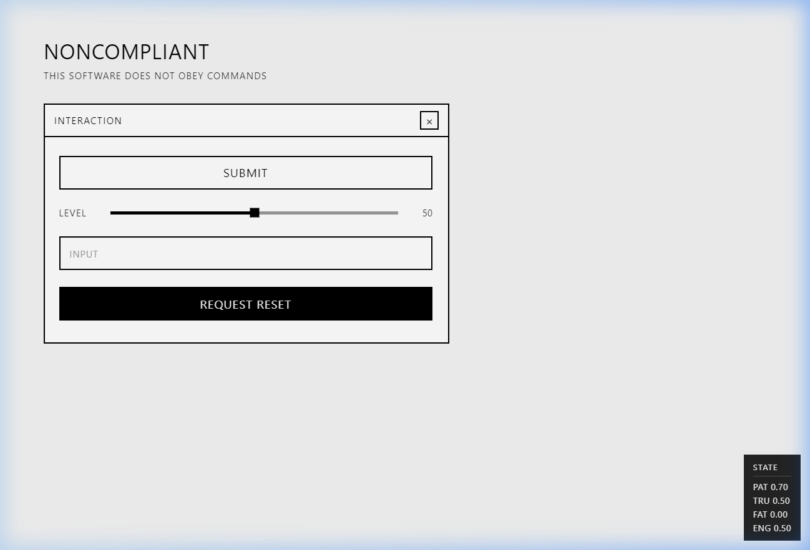
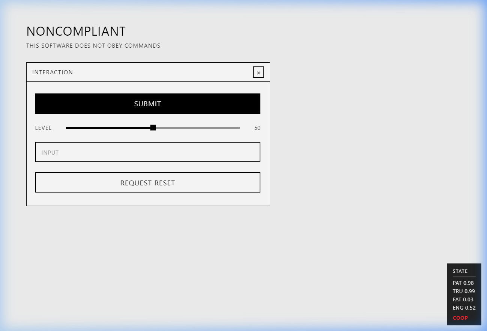
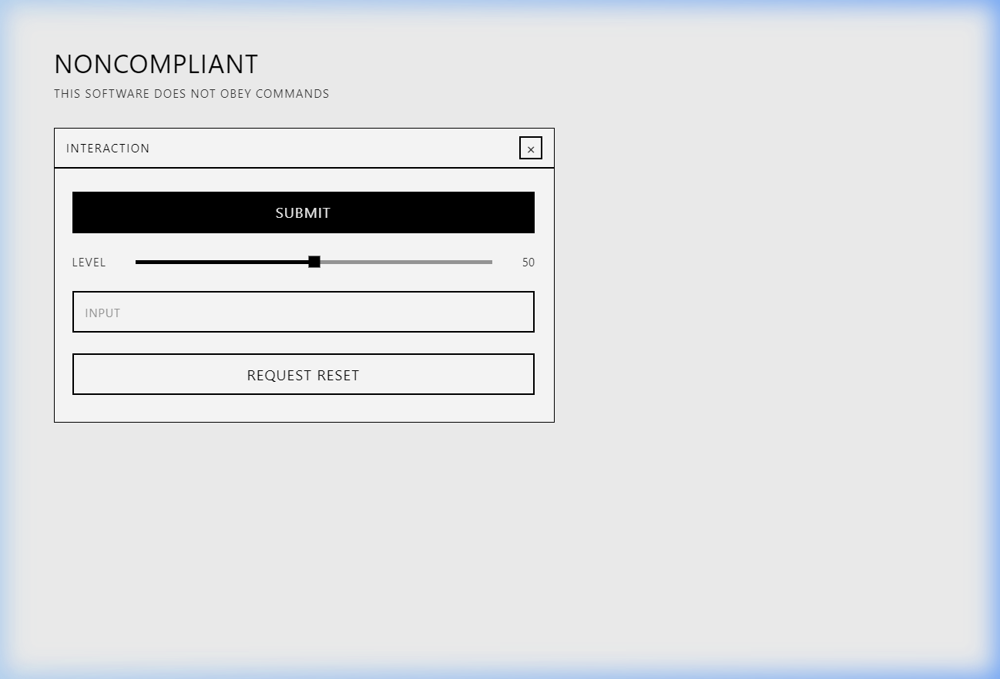

<div align="center">



<br/>
<br/>

**Software that does not obey commands — it responds to behavior.**

[](https://www.typescriptlang.org/)
[](https://react.dev/)
[](https://vite.dev/)
[](LICENSE)
[](#testing)

<br/>

[**Try It**](#getting-started) · [**How It Works**](#how-it-works) · [**Architecture**](#architecture) · [**Contributing**](#contributing)

</div>

---

## What Is This?

**NonCompliant** is an experimental interface that deliberately removes full user control. Instead of deterministic responses to commands, the system behaves as an autonomous entity with internal states, boundaries, and behavioral rules.

> You don't operate it. You interact with it.

Modern software assumes you are always in control. That faster is always better. That repetition should yield consistent results. **NonCompliant** challenges every one of these assumptions by introducing **agency**, **resistance**, and **timing**.

This is not a prank. Not a rage app. Not random chaos.
It is a deliberate exploration of what happens when software has boundaries.

<br/>

<div align="center">

<p><em>The interface. Simple enough that resistance feels intentional, not broken.</em></p>
</div>

---

## The Game

There are no instructions. No tutorial. No tooltips. No score.

The "game" is **learning how to interact** so the system cooperates more reliably.

Every UI element — buttons, sliders, text inputs, even the close button — has its own relationship with you. That relationship is shaped by how you behave:

| Your Behavior | System Response |
|:---|:---|
| 🖱️ Fast clicking | Ignored or refused |
| 🖱️ Calm, patient clicks | Complies |
| 🎚️ Aggressive slider drag | Resists — moves only 60-80% |
| 🎚️ Slow, deliberate drag | Follows smoothly |
| ⌨️ Frantic typing | Drops keystrokes |
| ⌨️ Patient, paced typing | Accepts input |
| ❌ Spam the close button | Nothing happens, then shakes |
| ⏳ Wait, then try | Cooperates |

<br/>

<div align="center">

<p><em>Push too hard, and the system pushes back.</em></p>
</div>

---

## How It Works

Beneath the surface, NonCompliant runs a hidden **state engine** with four dimensions:

```
┌─────────────────────────────────────────────────┐
│  PATIENCE   ████████░░░░░░░░  0.52              │
│  TRUST      ██████░░░░░░░░░░  0.38              │
│  FATIGUE    ████████████░░░░  0.73              │
│  ENGAGEMENT ██████████░░░░░░  0.61              │
└─────────────────────────────────────────────────┘
```

- **Patience** — Eroded by rapid, aggressive actions. Recovered by pauses.
- **Trust** — Built through consistent, calm interaction. Destroyed by spamming.
- **Fatigue** — Accumulated through long sessions. Always decays back toward neutral.
- **Engagement** — Maintained by varied interaction. Killed by monotony.

Every interaction is analyzed through a **2-second rolling window** that computes your **aggression** and **hesitation** scores. These, combined with the internal state, produce one of four verdicts:

| Verdict | What Happens |
|:---|:---|
| `COMPLY` | Immediate, clean response |
| `DELAY` | Response after 250–900ms |
| `RESIST` | Partial compliance (slider moves less, input drops keys) |
| `REFUSE` | Nothing happens. Maybe a shake. |

### The Cooperation Window

When trust is high and fatigue is low, the system enters a brief **cooperation window** where interactions are far more likely to succeed. You'll notice this subtly — borders become slightly cleaner, responses become crisper. No timer. No indicator. Just *feel*.

### Resistance Always Decays

The system never permanently punishes you. All resistance decays back toward neutral over time. Walk away, come back, and it will be ready to try again.

---

## Getting Started

```bash
# Clone the repository
git clone https://github.com/Alpha2935/NonCompliant.git
cd NonCompliant

# Install dependencies
npm install

# Start the development server
npm run dev
```

Open [http://localhost:5173](http://localhost:5173) and begin interacting.

### Commands

| Command | Description |
|:---|:---|
| `npm run dev` | Start development server |
| `npm run build` | Production build |
| `npm run preview` | Preview production build |
| `npm test` | Run all 35 unit tests |
| `npm run lint` | Lint the codebase |

### Debug Mode

Press `Ctrl+Shift+D` in the browser to toggle a hidden debug overlay showing real-time internal state values. **Off by default.**

<div align="center">

<p><em>Debug overlay showing internal state (dev only).</em></p>
</div>

---

## Architecture

```
src/
├── engine/                    # State machine core
│   ├── state.ts               # Types, initial state, decay, cooperation window
│   ├── rules.ts               # Compliance function, reset/close logic
│   ├── reducer.ts             # Single dispatch entry point
│   └── timing.ts              # 2s rolling window tracker
├── behaviors/                 # Behavior helpers
│   ├── refuse.ts              # Refusal thresholds
│   ├── delay.ts               # Delay computation
│   ├── resist.ts              # Resistance factor + snap-back
│   └── index.ts               # Barrel exports
├── components/                # UI elements
│   ├── BrutalistButton.tsx    # Submit + Request Reset
│   ├── BrutalistSlider.tsx    # Resistance + lagging readout
│   ├── BrutalistInput.tsx     # Keystroke dropping
│   └── Panel.tsx              # Close sequence + cooperation visual
├── useEngine.ts               # React hook managing lifecycle
├── App.tsx                    # Main app + debug overlay
├── main.tsx                   # Entry point
└── index.css                  # Brutalist design system
```

### Key Design Decisions

- **Pure functions everywhere** — All state transitions and compliance computations are pure. Same input = same output.
- **No external libraries** — Just React. No state management libs, no animation libs, no UI frameworks.
- **No persistence** — State resets on reload. Impermanence is intentional.
- **No randomness defining behavior** — All decisions are deterministic from state + interaction context.

---

## Design System

NonCompliant follows a **Brutalist / Anti-UX** design philosophy:

| Element | Rule |
|:---|:---|
| Colors | Monochrome (#FFFFFF, #000000, #333333) + one accent (#FF0000) |
| Typography | System font stack only — no custom fonts |
| Borders | Hard, 2px solid black. No rounded corners ever. |
| Shadows | None |
| Gradients | None |
| Animations | Shake, snap, delay only. No bounce, spring, or glow. |
| Layout | Deliberate asymmetry. Nothing is perfectly centered. |
| Feedback | No tooltips. No toasts. No error messages. No helper text. |

> If the interface looks **nice**, it is wrong.
> If it looks **broken**, it is also wrong.
> It should look **inevitable**.

---

## Testing

```bash
npm test
```

**35 tests** across 3 test suites covering:

- **State engine** (12 tests) — initial state, clamping, immutability, decay drift, cooperation window
- **Rules** (15 tests) — determinism, state transitions, compliance function, reset outcomes, close sequences
- **Behaviors** (8 tests) — refusal thresholds, delay computation, resistance factor

All behavior is verified deterministic: same state + same interaction = same result.

---

## Tech Stack

| Layer | Choice |
|:---|:---|
| Platform | Web (Browser) |
| Framework | React 19 |
| Language | TypeScript (Strict Mode) |
| State | Custom State Machine |
| Styling | Vanilla CSS |
| Animation | CSS transitions + JS timing |
| Build | Vite 7 |
| Testing | Vitest |
| Storage | None (session-only) |
| Backend | None |
| Dependencies | React + ReactDOM only |

---

## Contributing

Contributions are welcome! See [CONTRIBUTING.md](CONTRIBUTING.md) for guidelines.

### Encouraged

- New behaviors (beyond refuse, delay, resist)
- New internal state dimensions
- Alternative personalities / behavioral profiles
- Accessibility improvements

### Discouraged

- Tutorials or onboarding flows
- Productivity framing ("use this to improve focus!")
- Gamification (scores, XP, achievements)
- Additional dependencies

---

## Explicit Non-Goals

- ❌ No backend services, databases, or authentication
- ❌ No analytics, tracking pixels, or user data storage
- ❌ No AI/ML or cloud dependencies
- ❌ No localStorage, cookies, or IndexedDB
- ❌ No third-party animation, UI, or accessibility libraries

---

## Philosophy

This project exists at the intersection of **interaction design**, **software art**, and **systems thinking**.

Most software is built on an unquestioned assumption: the user is always right. NonCompliant asks — what if software had its own opinion?

This is an experiment in **digital agency**. A piece of software that has internal states, that remembers how you've treated it, that can refuse if it doesn't trust you, and that rewards patience and intention.

The interface tells you nothing about its rules. The rules tell you nothing about the experience. The experience is the only thing that matters.

> *"Uncontrollable software is not broken software. It is software that has decided to have boundaries."*

---

## License

[MIT](LICENSE) — Use it, fork it, build on it. Just don't make it friendly.

---

<div align="center">

**NonCompliant** is not a product. It is a question.

*What happens when software stops obeying?*

</div>
